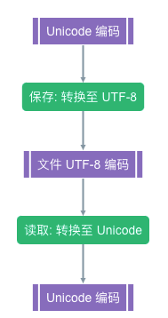

# 计算机编码介绍

本文作者：[Mr.Hope](https://github.com/Mister-Hope/) [原文链接](https://mrhope.site/code/basic/encoding/)

计算机，不能直接存储文字，存储的是编码。

计算机只能处理二进制的数据，也就是说计算机只能处理数字。如果要处理文本，比如: `0-9`、`a-z`、`A-Z`，就必须先把文本转换为数字才能处理。
对于这些字符，可以定义一套规则来显示，比如: `A` 用 `110` 表示，`B` 用 `111` 表示等。

## 字符编码

最早的计算机在设计时采用 8 个比特(bit)作为一个字节(byte)，所以，一个字节能表示的最大的整数就是 255(二进制 11111111=十进制 255)，
如果要表示更大的整数，就必须用更多的字节。比如两个字节可以表示的最大整数是 `65535`，4 个字节可以表示的最大整数是 `4294967295`。

由于计算机是美国人发明的，因此，最早只有 127 个字符被编码到计算机里，也就是大小写英文字母、数字和一些符号，这个编码表被称为 ASCII 编码，
比如大写字母 A 的编码是 65，小写字母 z 的编码是 122。

但是要处理中文显然一个字节是不够的，至少需要两个字节，而且还不能和 ASCII 编码冲突，所以，中国制定了 GB2312 编码，用来把中文编进去。

您可以想得到的是，全世界有上百种语言，日本把日文编到 Shift_JIS 里，韩国把韩文编到 Euc-kr 里，各国有各国的标准，就会不可避免地出现冲突，结果就是，在多语言混合的文本中，显示出来会有乱码。

因此，Unicode 应运而生。Unicode 把所有语言都统一到一套编码里，这样就不会再有乱码问题了。

Unicode 标准也在不断发展，但最常用的是用两个字节表示一个字符(如果要用到非常偏僻的字符，就需要 4 个字节)。现代操作系统和大多数编程语言都直接支持 Unicode。

现在，捋一捋 ASCII 编码和 Unicode 编码的区别: ASCII 编码是 1 个字节，而 Unicode 编码通常是 2 个字节。

字母 A 用 ASCII 编码是十进制的 65，二进制的 01000001；

字符 0 用 ASCII 编码是十进制的 48，二进制的 00110000，注意字符 `'0'` 和整数 `0` 是不同的；

汉字中已经超出了 ASCII 编码的范围，用 Unicode 编码是十进制的 20013，二进制的 01001110 00101101。

您可以猜测，如果把 ASCII 编码的 A 用 Unicode 编码，只需要在前面补 0 就可以，因此，A 的 Unicode 编码是 00000000 01000001。

新的问题又出现了: 如果统一成 Unicode 编码，乱码问题从此消失了。但是，如果您写的文本基本上全部是英文的话，用 Unicode 编码比 ASCII 编码需要多一倍的存储空间，在存储和传输上就十分不划算。

所以，本着节约的精神，又出现了把 Unicode 编码转化为“可变长编码”的 UTF-8 编码。UTF-8 编码把一个 Unicode 字符根据不同的数字大小
编码成 1-6 个字节，常用的英文字母被编码成 1 个字节，汉字通常是 3 个字节，只有很生僻的字符才会被编码成 4-6 个字节。如果您要传输的文本
包含大量英文字符，用 UTF-8 编码就能节省空间:

| 字符 | ASCII    | Unicode           | UTF-8                      |
| ---- | -------- | ----------------- | -------------------------- |
| A    | 01000001 | 00000000 01000001 | 01000001                   |
| 中   | x        | 01001110 00101101 | 11100100 10111000 10101101 |

从上面的表格还可以发现，UTF-8 编码有一个额外的好处，就是 ASCII 编码实际上可以被看成是 UTF-8 编码的一部分，所以，大量只支持 ASCII
编码的历史遗留软件可以在 UTF-8 编码下继续工作。

搞清楚 ASCII、Unicode 和 UTF-8 的关系，现在可以总结计算机系统通用的字符编码工作方式:

在计算机内存中，统一使用 Unicode 编码，当需要保存到硬盘或者需要传输的时候，就转换为 UTF-8 编码。

用编辑器编辑的时候，从文件读取的 UTF-8 字符被转换为 Unicode 字符到内存里，编辑完成后，保存的时候再把 Unicode 转换为 UTF-8 保存到文件:

浏览网页的时候，服务器会把动态生成的 Unicode 内容转换为 UTF-8 再传输到浏览器:

所以您看到很多网页的源码上会有类似 `<meta charset="UTF-8" />` 的信息，表示该网页正是用的 UTF-8 编码。

## ASCII 码

美国发布的，用 1 个字节 (8 位二进制) 来表示一个字符，共可以表示 2^8^=256 个字符。

美国的国家语言是英语，只要能表示 0-9、a-z、A-Z、特殊符号。

## ANSI 编码

**每个国家为了显示本国的语言，都对 ASCII 码进行了扩展**。用 2 个字节 (16 位二进制) 来表示一个汉字，共可以表示
$2^{16} = 65536$ 个汉字。例如:

- 中国的 ANSI 编码是 GB2312 编码(简体)，对 6763 汉字进行编码，含 600 多特殊字符。另外还有 GBK(简体)。
- 日本的 ANSI 编码是 JIS 编码。
- 台湾的 ANSI 编码是 BIG5 编码(繁体)。

### GBK

对 GB2312 进行了扩展，用来显示罕见的、古汉语的汉字。现在已经收录了 2.1 万左右。并提供了 1890 个汉字码位。`K` 的含义就是“扩展”。

## Unicode 编码(统一编码)

用 4 个字节 (32 位二进制) 来表示一个字符，想法不错，但效率太低。例如，字母 A 用 ASCII 表示的话一个字节就够，可用 Unicode 编码的话，
得用 4 个字节表示，造成了空间的极大浪费。A 的 Unicode 编码是 `0000 0000 0000 0000 0000 0000 0100 0000`

## UTF-8 (Unicode Transform Format)编码

根据字符的不同，选择其编码的长度。比如:一个字符 A 用 1 个字节表示，一个汉字用 2 个字节表示。

毫无疑问，开发中，都用 **UTF-8** 编码吧，准没错。

::: tip

**中文能够使用的字符集两种:**

- 第一种:UTF-8。UTF-8 是国际通用字库，里面涵盖了所有地球上所有人类的语言文字，比如阿拉伯文、汉语、老挝语……

- 第二种:GBK (对 GB2312 进行了扩展)。gb2312 是国标，是中国的字库，里面**仅**涵盖了汉字和一些常用外文，比如日文片假名，和常见的符号。

字库规模: UTF-8 (字全) > gb2312 (只有汉字)

保存大小: UTF-8 (更臃肿、加载更慢) > gb2312 (更小巧，加载更快)

:::
