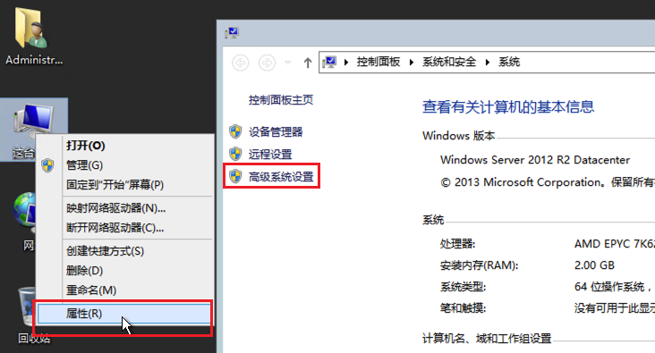
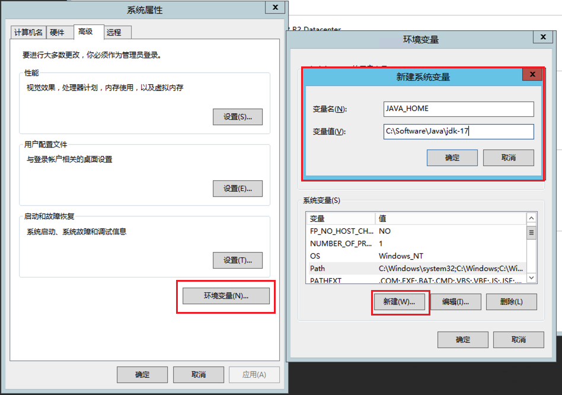
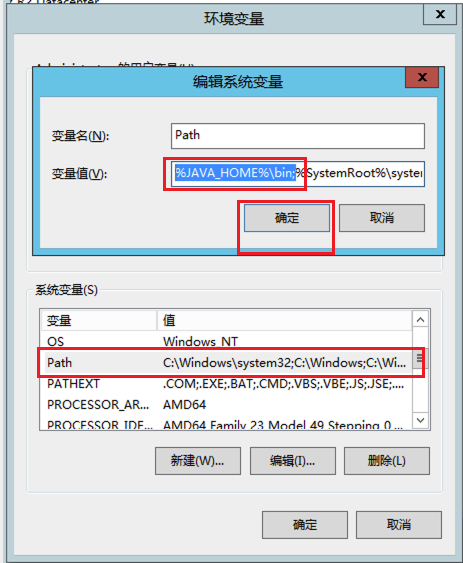
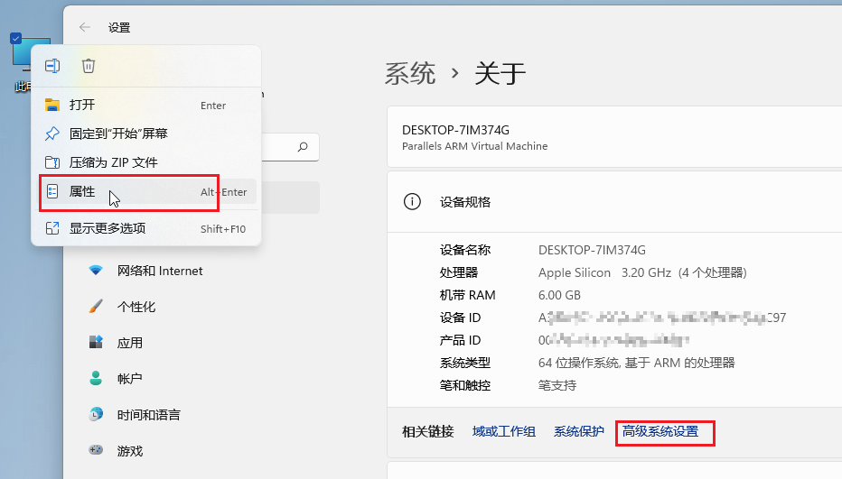
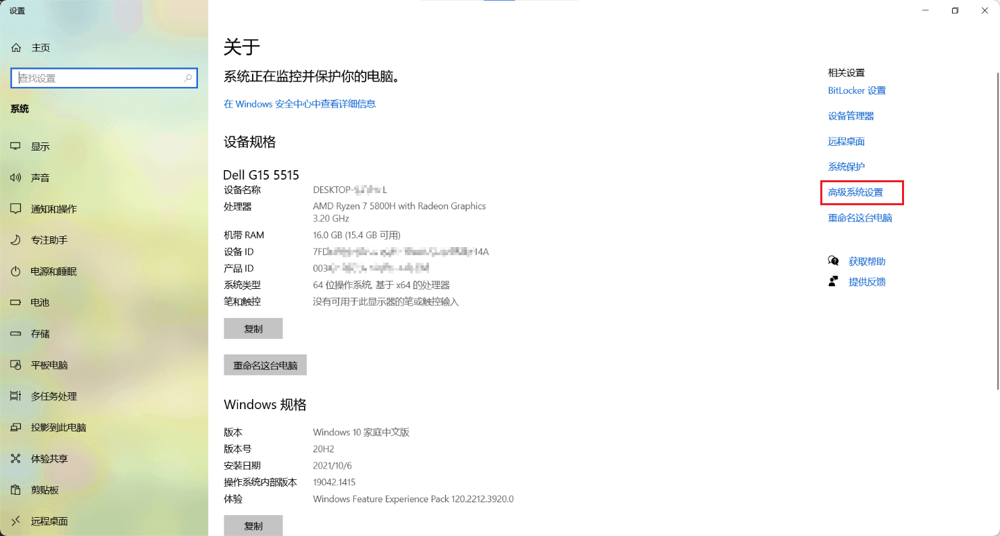
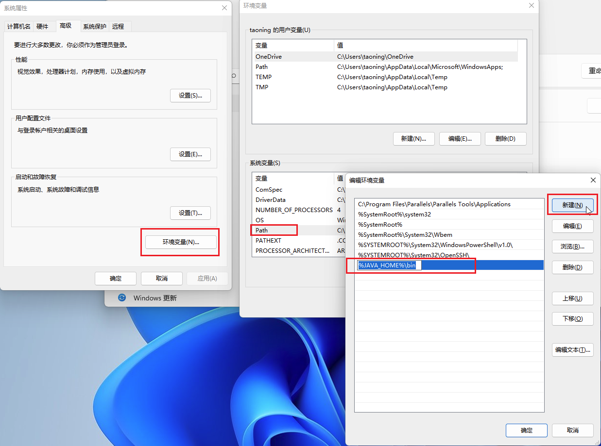

# 如何设置系统环境变量

## Windows 平台

### Windows 10 之前的版本

这里以 Windows 8 系为例，Windows 7 同理。

1. 右击**这台电脑**，点击**属性**，点击**高级系统设置**

   

2. 点击**高级**选项卡下方的**环境变量**按钮。

   如果你希望新建一个环境变量，点击**新建**按钮，填写你希望新建的**变量名**以及**变量值**（如路径名）即可。

   

   如果你希望在`Path`变量中添加内容，则找到`Path`变量，点击**编辑**。在最前面或最后面加入你希望添加的路径。**注意：不同路径之间需要使用*英文分号*（`;`）分隔。**

   

### Windows 10 及 Windows 11

右击**此电脑**，选择**属性**，找到**高级系统设置**。（Windows 11 如**图 1**，Windows 10 如**图 2**）

创建环境变量与上方相似，修改`Path`变量方式如下（当然你可以通过点击右下角的**编辑文本**来手动修改`Path`变量）：

## Linux / macOS 平台

### 临时修改

如果你需要这次修改仅仅对当前的 shell 生效，则可以直接在当前的终端下执行`export 变量名="变量值"`，例如，设置`JAVA_HOME`环境变量可以执行`export JAVA_HOME="Java路径"`，设置`PATH`变量则可以执行`export PATH=添加的路径:$PATH`。注意，与 Windows 不同，Linux 和 macOS 使用的是**英文冒号**而不是**英文分号**。

### 永久修改

在登录用户的`~/.bash_profile`（`bash`用户）或`~/.zprofile`（`zsh`用户）文件最后加入在上方**临时修改**中执行的命令即可。

<Utterances />
